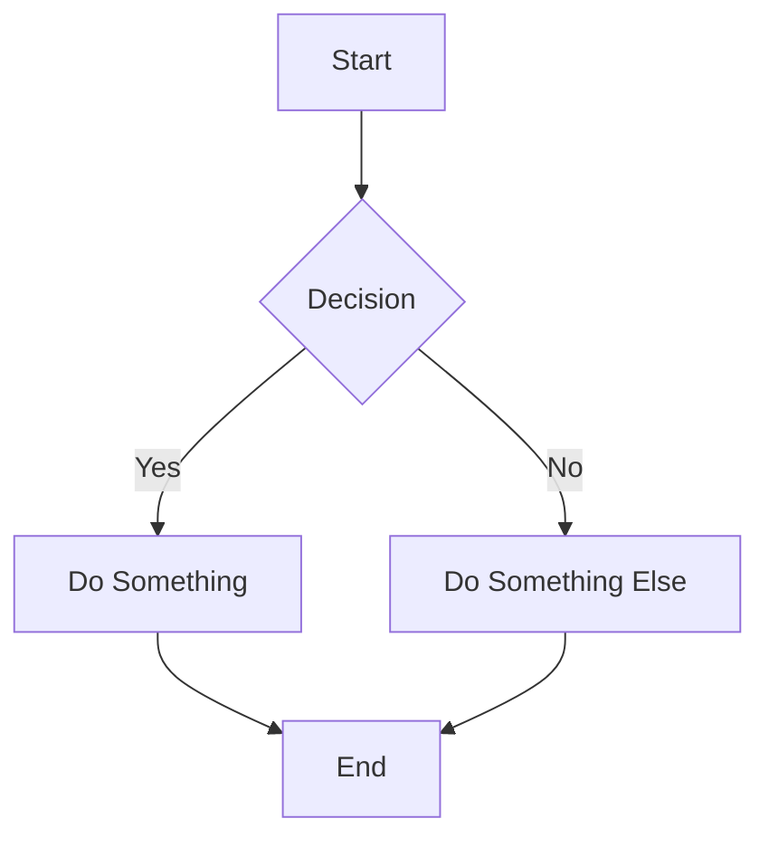
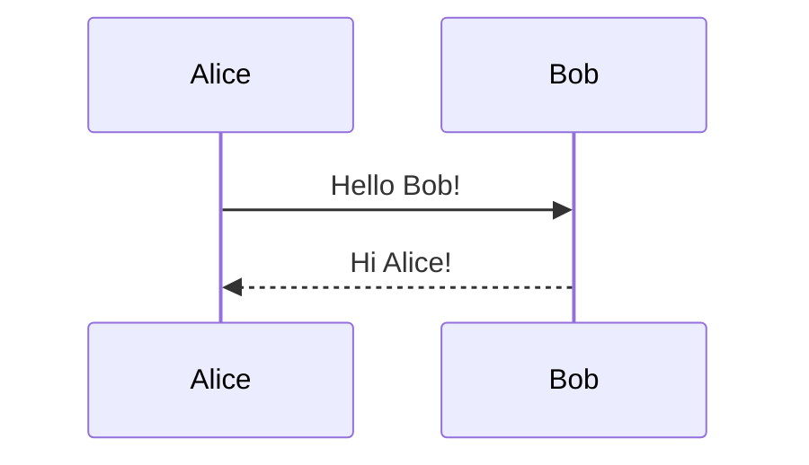
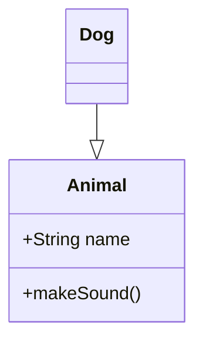

# ARCHITECTURE DIAGRAMS - SUNSET ERP

**Location:** `docs/02-architecture/diagrams/`  
**Format:** Mermaid (renders in GitHub, VS Code, GitLab)  
**Status:** Complete

---

## AVAILABLE DIAGRAMS

### 1. [Entity Relationship Diagram (ERD)](./erd.md)
**Type:** Database schema  
**Auto-generated:** Yes (from Prisma schema)  
**Content:** All 50 database tables with relationships

**To regenerate:**
```bash
cd backend
npx prisma generate
```

Shows complete database structure including:
- Multi-tenant tables (tenant_id foreign keys)
- All relationships and cardinality
- Table prefixes (saas_, auth_, po_, in_, so_, ac_, mfg_)

---

### 2. [Class Diagram](./class-diagram.md)
**Type:** Domain model  
**Auto-generated:** No (manually created)  
**Content:** Core business entities and their relationships

**Key Classes:**
- **SaaS Core:** Tenant, User, UserTenant, Role, Permission
- **Procurement:** Supplier, PurchaseOrder, PurchaseOrderLine
- **Inventory:** Item, Warehouse, Stock, StockMovement
- **Sales:** Customer, SalesOrder, SalesOrderLine
- **Manufacturing:** Bom, BomComponent, ProductionOrder
- **Accounting:** Account, JournalEntry, JournalEntryLine

Shows:
- Attributes and methods
- Relationships and cardinality
- Multi-tenant patterns
- Business logic placement

---

### 3. [Sequence Diagram - User Login](./sequence-login.md)
**Type:** Authentication flow  
**Content:** Complete login and tenant selection process

**Flow:**
1. User submits credentials
2. Password validation (bcrypt)
3. Account lockout check (5 failed attempts)
4. Generate JWT tokens (access + refresh)
5. Tenant list retrieval
6. Tenant selection
7. New token with tenantId
8. Redirect to dashboard

**Security Features:**
- Password hashing
- Account lockout
- JWT token management
- Session caching (Redis)
- Audit logging

---

### 4. [Sequence Diagram - Create Purchase Order](./sequence-create-po.md)
**Type:** Business transaction flow  
**Content:** Multi-tenant PO creation with security layers

**Flow:**
1. User submits PO form
2. Tenant middleware extracts tenantId from JWT
3. PostgreSQL session: `SET app.tenant_id`
4. Authentication guard (JWT validation)
5. Permission guard (RBAC check)
6. Supplier validation (tenant ownership)
7. Item validation (tenant ownership)
8. Transaction: Create PO + lines
9. Audit log entry
10. Event emission (notifications, webhooks)

**Security Layers:**
- Application: Prisma middleware
- Database: Row-Level Security (RLS)
- Testing: Cross-tenant isolation tests

---

### 5. [Component Diagram](./component-diagram.md)
**Type:** NestJS application architecture  
**Content:** Module organization and dependencies

**Components:**
- **Core Modules:** Config, Prisma, Cache, Auth
- **Shared Services:** TenantMiddleware, Guards, Prisma, Cache, Email, Storage
- **Business Modules:** Tenant, User, Procurement, Inventory, Sales, Manufacturing, Accounting, Billing
- **External Services:** PostgreSQL, Redis, S3, Stripe, SendGrid

**Shows:**
- Module dependencies
- Dependency injection
- Guard execution order
- Service layer structure

---

### 6. [Deployment Diagram](./deployment-diagram.md)
**Type:** Infrastructure architecture  
**Content:** AWS deployment on production

**Infrastructure:**
- **Edge:** Cloudflare CDN (DDoS, SSL, WAF)
- **DNS:** Route 53 (health checks, failover)
- **Load Balancer:** Application Load Balancer
- **Compute:** ECS Fargate (3-20 auto-scaling tasks)
- **Database:** RDS PostgreSQL Multi-AZ + 2 read replicas
- **Cache:** ElastiCache Redis cluster (3 nodes)
- **Storage:** S3 (uploads, backups, logs)
- **Monitoring:** CloudWatch + Datadog
- **DR:** Cross-region replication (us-west-2)

**Costs:** ~$1,115/month (1,000 tenants)

---

## DIAGRAM TYPES SUMMARY

| Diagram | Type | Auto-Generated | Purpose |
|---------|------|----------------|---------|
| ERD | Database | ✅ Yes | Database schema visualization |
| Class | Domain Model | ❌ No | Business entities and logic |
| Sequence (Login) | Behavior | ❌ No | Authentication flow |
| Sequence (PO) | Behavior | ❌ No | Multi-tenant transaction |
| Component | Structure | ❌ No | NestJS module architecture |
| Deployment | Infrastructure | ❌ No | AWS production setup |

---

## HOW TO VIEW DIAGRAMS

### GitHub (Recommended)
1. Navigate to `docs/02-architecture/diagrams/`
2. Click any `.md` file
3. Diagrams render automatically ✨

### VS Code
1. Install extension: "Markdown Preview Mermaid Support"
2. Open any diagram `.md` file
3. Press `Ctrl+Shift+V` (preview)

### Mermaid Live Editor
1. Open https://mermaid.live/
2. Copy diagram code
3. Paste into editor
4. Download as PNG/SVG

---

## AUTO-GENERATION SETUP

### ERD Auto-Generation

The ERD is auto-generated from the Prisma schema using `prisma-erd-generator`.

**Configuration** (`backend/prisma/schema.prisma`):
```prisma
generator erd_mermaid {
  provider = "prisma-erd-generator"
  output   = "../../docs/02-architecture/diagrams/erd.md"
}
```

**To regenerate:**
```bash
cd backend
npx prisma generate
```

**When to regenerate:**
- After any Prisma schema changes
- Before committing database changes
- During code reviews

---

## MAINTAINING DIAGRAMS

### ERD (Auto-Generated)
- ✅ **Always up-to-date** - Regenerated automatically
- ⚠️ **Never manually edit** - Changes will be overwritten
- 📝 **Update via:** Modify `backend/prisma/schema.prisma`

### Other Diagrams (Manual)
- 📝 **Update when:** Architecture changes significantly
- 📅 **Review:** Quarterly or before major releases
- ✅ **Keep simple:** Don't over-complicate diagrams

**Update Triggers:**
- New module added
- Authentication flow changes
- Deployment infrastructure changes
- Major refactoring

---

## DIAGRAM BEST PRACTICES

### Mermaid Syntax


### Sequence Diagram


### Class Diagram


---

## EXPORT OPTIONS

### PNG/SVG Export
1. Open diagram in Mermaid Live Editor
2. Click "Actions" → "Export"
3. Choose PNG or SVG format
4. Download

### Include in Documentation
```markdown
# Architecture Overview

See our deployment architecture:


```

---

## RELATED DOCUMENTATION

- **Prisma Schema:** `backend/prisma/schema.prisma` (source of truth for ERD)
- **System Architecture:** `docs/02-architecture/system-architecture.md`
- **ADRs:** `docs/02-architecture/adr/` (architecture decisions)
- **Database Design:** `docs/03-database/` (detailed database docs)

---

**Total Diagrams:** 6  
**Auto-Generated:** 1 (ERD)  
**Manual:** 5 (Class, Sequences, Component, Deployment)  
**Format:** Mermaid (GitHub-compatible)  
**Status:** ✅ Complete

---

**Last Updated:** March 15, 2026  
**Maintained By:** Architecture Team