# Domain Model - Class Diagram

```mermaid
classDiagram
    %% Core SaaS Classes
    class Tenant {
        +UUID id
        +String code
        +String name
        +String subscriptionPlan
        +String status
        +DateTime createdAt
        +getActiveUsers()
        +getCurrentUsage()
    }

    class User {
        +UUID id
        +String email
        +String passwordHash
        +String firstName
        +String lastName
        +Boolean twoFactorEnabled
        +validatePassword()
        +hasPermission()
    }

    class UserTenant {
        +UUID userId
        +UUID tenantId
        +Boolean isDefault
        +Boolean isActive
    }

    class Role {
        +UUID id
        +UUID tenantId
        +String code
        +String name
        +getPermissions()
    }

    class Permission {
        +UUID id
        +String code
        +String name
        +String module
    }

    %% Procurement Classes
    class Supplier {
        +UUID id
        +UUID tenantId
        +String code
        +String name
        +String email
        +Decimal creditLimit
        +Boolean isActive
        +placeOrder()
        +calculateOutstanding()
    }

    class PurchaseOrder {
        +UUID id
        +UUID tenantId
        +UUID supplierId
        +String poNumber
        +Date poDate
        +Decimal total
        +String status
        +addLine()
        +submit()
        +approve()
        +cancel()
        +calculateTotal()
    }

    class PurchaseOrderLine {
        +UUID id
        +UUID purchaseOrderId
        +UUID itemId
        +Integer lineNumber
        +Decimal orderedQuantity
        +Decimal unitPrice
        +Decimal lineTotal
        +calculateLineTotal()
    }

    %% Inventory Classes
    class Item {
        +UUID id
        +UUID tenantId
        +String code
        +String name
        +String itemType
        +Boolean isStockable
        +Boolean isPurchasable
        +Boolean isSaleable
        +getAvailableStock()
        +getReorderPoint()
        +reserve()
    }

    class Warehouse {
        +UUID id
        +UUID tenantId
        +String code
        +String name
        +String warehouseType
        +Boolean isActive
        +getStockLevels()
    }

    class Stock {
        +UUID id
        +UUID tenantId
        +UUID itemId
        +UUID warehouseId
        +Decimal onHandQuantity
        +Decimal reservedQuantity
        +String lotNumber
        +getAvailableQuantity()
        +reserve()
        +unreserve()
        +move()
    }

    class StockMovement {
        +UUID id
        +UUID tenantId
        +String movementNumber
        +String movementType
        +UUID itemId
        +UUID fromWarehouseId
        +UUID toWarehouseId
        +Decimal quantity
        +execute()
    }

    %% Sales Classes
    class Customer {
        +UUID id
        +UUID tenantId
        +String code
        +String name
        +Decimal creditLimit
        +String creditStatus
        +Boolean isActive
        +checkCreditLimit()
        +placeOrder()
    }

    class SalesOrder {
        +UUID id
        +UUID tenantId
        +UUID customerId
        +String soNumber
        +Date orderDate
        +Decimal total
        +String status
        +addLine()
        +checkCreditLimit()
        +reserveStock()
        +ship()
        +calculateTotal()
    }

    class SalesOrderLine {
        +UUID id
        +UUID salesOrderId
        +UUID itemId
        +Integer lineNumber
        +Decimal orderedQuantity
        +Decimal shippedQuantity
        +Decimal unitPrice
        +Decimal lineTotal
        +calculateLineTotal()
    }

    %% Manufacturing Classes
    class Bom {
        +UUID id
        +UUID tenantId
        +UUID parentItemId
        +String bomNumber
        +Integer version
        +Boolean isActive
        +addComponent()
        +calculateCost()
    }

    class BomComponent {
        +UUID id
        +UUID bomId
        +UUID componentItemId
        +Integer lineNumber
        +Decimal quantityPer
        +Decimal scrapPercent
    }

    class ProductionOrder {
        +UUID id
        +UUID tenantId
        +String poNumber
        +UUID itemId
        +UUID bomId
        +Decimal quantityToProduce
        +Decimal quantityProduced
        +String status
        +start()
        +complete()
        +consumeMaterials()
    }

    %% Accounting Classes
    class Account {
        +UUID id
        +UUID tenantId
        +String accountNumber
        +String name
        +String accountType
        +Boolean isActive
        +getBalance()
        +post()
    }

    class JournalEntry {
        +UUID id
        +UUID tenantId
        +String entryNumber
        +Date entryDate
        +String status
        +addLine()
        +isBalanced()
        +post()
        +reverse()
    }

    class JournalEntryLine {
        +UUID id
        +UUID journalEntryId
        +UUID accountId
        +Integer lineNumber
        +Decimal debitAmount
        +Decimal creditAmount
    }

    %% Relationships - Multi-tenancy
    Tenant "1" --> "*" UserTenant : has
    User "1" --> "*" UserTenant : belongs to
    Tenant "1" --> "*" Role : defines
    Role "1" --> "*" Permission : has

    %% Relationships - Procurement
    Tenant "1" --> "*" Supplier : has
    Tenant "1" --> "*" PurchaseOrder : has
    Supplier "1" --> "*" PurchaseOrder : receives
    PurchaseOrder "1" --> "*" PurchaseOrderLine : contains
    Item "1" --> "*" PurchaseOrderLine : ordered in

    %% Relationships - Inventory
    Tenant "1" --> "*" Item : has
    Tenant "1" --> "*" Warehouse : has
    Item "1" --> "*" Stock : stored as
    Warehouse "1" --> "*" Stock : stores
    Item "1" --> "*" StockMovement : moved in
    Warehouse "1" --> "*" StockMovement : from/to

    %% Relationships - Sales
    Tenant "1" --> "*" Customer : has
    Customer "1" --> "*" SalesOrder : places
    SalesOrder "1" --> "*" SalesOrderLine : contains
    Item "1" --> "*" SalesOrderLine : sold in

    %% Relationships - Manufacturing
    Item "1" --> "*" Bom : produces
    Bom "1" --> "*" BomComponent : contains
    Item "1" --> "*" BomComponent : component of
    Tenant "1" --> "*" ProductionOrder : has
    Item "1" --> "*" ProductionOrder : manufactured

    %% Relationships - Accounting
    Tenant "1" --> "*" Account : has
    Tenant "1" --> "*" JournalEntry : has
    JournalEntry "1" --> "*" JournalEntryLine : contains
    Account "1" --> "*" JournalEntryLine : posted to
```

**Key Domain Model Principles:**

1. **Multi-Tenancy**: Every business entity has `tenantId`
2. **Aggregate Roots**: Tenant, PurchaseOrder, SalesOrder, JournalEntry
3. **Value Objects**: Money amounts, quantities, codes
4. **Business Logic**: Embedded in entity methods (calculateTotal, reserve, etc.)
5. **Relationships**: Clearly defined foreign keys and cardinality

**Notes:**
- All classes shown with key attributes and methods
- Relationships show cardinality (1, *, etc.)
- Business logic encapsulated in domain entities
- Follows DDD (Domain-Driven Design) principles