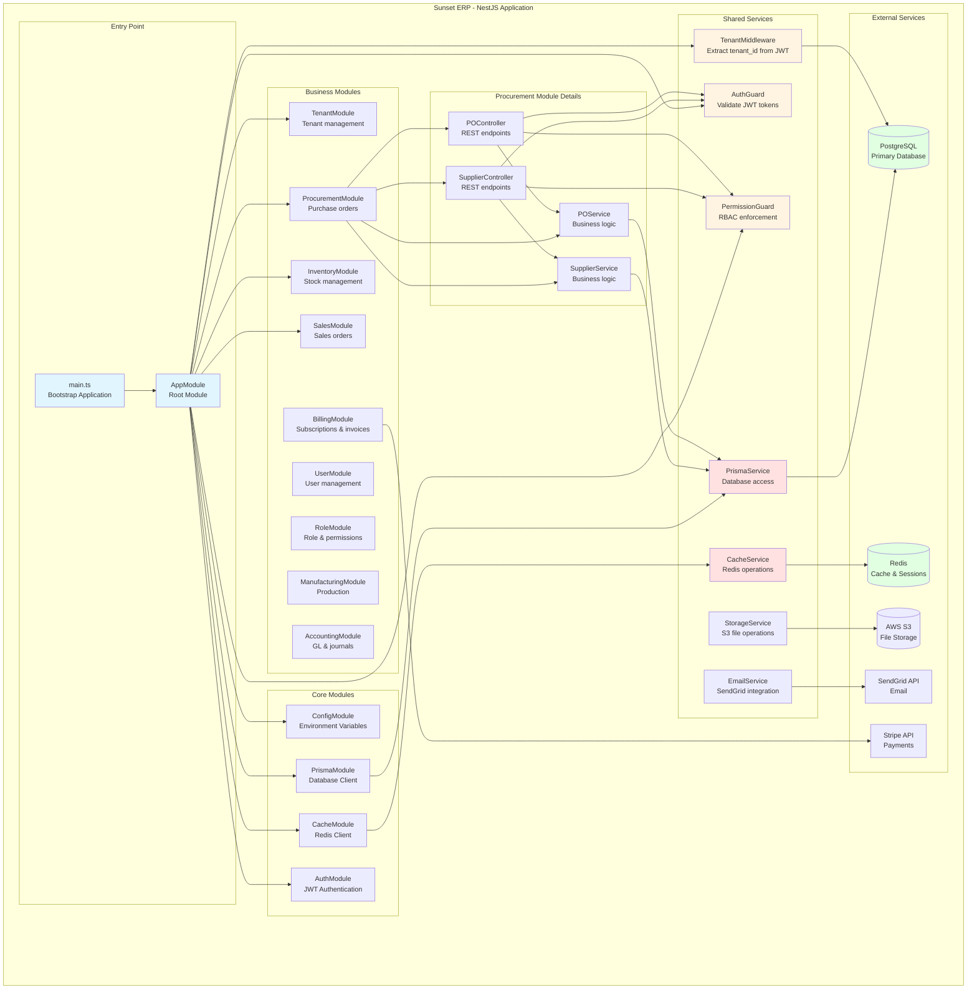

# NestJS Component Architecture - Component Diagram



## Module Responsibilities

### Core Modules

**ConfigModule**
- Load environment variables
- Validate configuration
- Provide typed config service

**PrismaModule**
- Database connection management
- Global Prisma client instance
- Transaction support

**CacheModule**
- Redis connection
- Cache operations
- Session storage

**AuthModule**
- JWT token generation/validation
- Password hashing (bcrypt)
- Login/logout endpoints
- Token refresh logic

### Shared Services

**TenantMiddleware**
```typescript
@Injectable()
export class TenantMiddleware implements NestMiddleware {
  async use(req: Request, res: Response, next: NextFunction) {
    // Extract tenantId from JWT
    const tenantId = req.user?.tenantId;
    
    // Set PostgreSQL session variable
    await prisma.$executeRaw`SET app.tenant_id = ${tenantId}`;
    
    next();
  }
}
```

**AuthGuard**
```typescript
@Injectable()
export class JwtAuthGuard extends AuthGuard('jwt') {
  canActivate(context: ExecutionContext) {
    // Validate JWT token
    // Attach user to request
    return super.canActivate(context);
  }
}
```

**PermissionGuard**
```typescript
@Injectable()
export class PermissionsGuard implements CanActivate {
  canActivate(context: ExecutionContext) {
    // Check if user has required permission
    // e.g., PROCUREMENT:CREATE
    const requiredPermissions = this.reflector.get(...);
    const user = context.switchToHttp().getRequest().user;
    
    return user.permissions.some(p => requiredPermissions.includes(p));
  }
}
```

### Business Modules

**ProcurementModule**
- Supplier CRUD
- Purchase Order CRUD
- PO approval workflow
- Goods receipt

**InventoryModule**
- Item master data
- Stock levels
- Stock movements
- Lot/serial tracking

**SalesModule**
- Customer CRUD
- Sales Order CRUD
- Order fulfillment
- Shipping

**ManufacturingModule**
- Bill of Materials (BOM)
- Production orders
- Work orders
- Material consumption

**AccountingModule**
- Chart of accounts
- Journal entries
- General ledger
- Financial reports

**BillingModule**
- Subscription management
- Invoice generation
- Payment processing (Stripe)
- Usage tracking

## Module Communication

### Direct Imports (Synchronous)
```typescript
@Module({
  imports: [PrismaModule, InventoryModule],
  controllers: [POController],
  providers: [POService],
})
export class ProcurementModule {}

// POService can inject InventoryService
@Injectable()
export class POService {
  constructor(
    private prisma: PrismaService,
    private inventoryService: InventoryService
  ) {}
}
```

### Event-Based (Asynchronous)
```typescript
// Emit event
this.eventEmitter.emit('purchase_order.created', {
  poId: po.id,
  tenantId: po.tenantId,
});

// Listen to event (in another module)
@OnEvent('purchase_order.created')
handlePOCreated(payload: POCreatedEvent) {
  // Update analytics
  // Send notification
  // Trigger webhooks
}
```

## Dependency Injection

All services use NestJS dependency injection:

```typescript
@Injectable()
export class POService {
  constructor(
    private readonly prisma: PrismaService,
    private readonly cache: CacheService,
    private readonly email: EmailService,
    private readonly eventEmitter: EventEmitter2,
  ) {}
}
```

**Benefits:**
- Testability (easy to mock dependencies)
- Loose coupling
- Lifecycle management
- Single responsibility

## Guard Application

```typescript
@Controller('procurement/purchase-orders')
@UseGuards(JwtAuthGuard, PermissionsGuard)
export class POController {
  
  @Post()
  @RequirePermissions('PROCUREMENT:CREATE')
  async create(@Body() dto: CreatePODto) {
    // Guards execute before this
    // User is authenticated & authorized
    return this.poService.create(dto);
  }
}
```

**Execution Order:**
1. TenantMiddleware (sets tenant context)
2. JwtAuthGuard (validates JWT)
3. PermissionsGuard (checks RBAC)
4. Controller method executes

## Testing Strategy

**Unit Tests**
```typescript
describe('POService', () => {
  let service: POService;
  let prisma: PrismaService;

  beforeEach(async () => {
    const module = await Test.createTestingModule({
      providers: [
        POService,
        { provide: PrismaService, useValue: mockPrisma }
      ],
    }).compile();

    service = module.get<POService>(POService);
  });
});
```

**Integration Tests**
```typescript
describe('PO API (e2e)', () => {
  let app: INestApplication;
  
  beforeEach(async () => {
    const moduleFixture = await Test.createTestingModule({
      imports: [AppModule],
    }).compile();
    
    app = moduleFixture.createNestApplication();
    await app.init();
  });
});
```