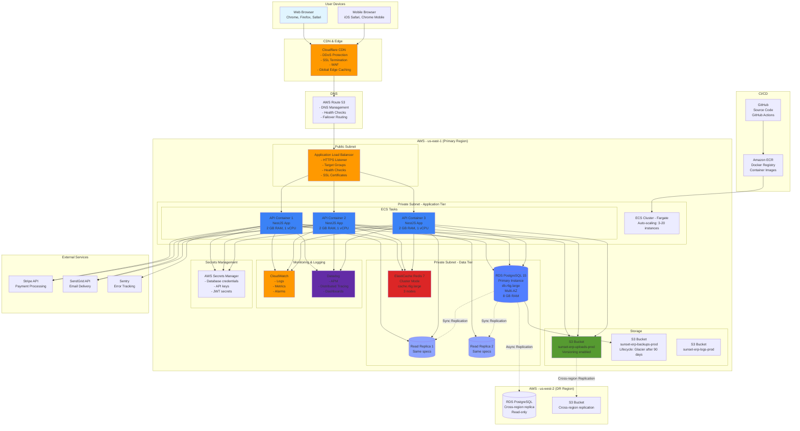

# Deployment Architecture - Deployment Diagram



## Infrastructure Components

### Edge Layer (Cloudflare)
**Purpose:** Global CDN, DDoS protection, SSL termination

**Features:**
- Global edge network (200+ cities)
- DDoS protection (automatic mitigation)
- Web Application Firewall (WAF)
- SSL/TLS certificates (auto-renewal)
- Page rules for caching
- Rate limiting

**Configuration:**
```
Static Assets: Cache for 1 year
API Calls: No cache (always origin)
Security Level: High
Min TLS: 1.3
HSTS: Enabled (max-age: 31536000)
```

### DNS (Route 53)
**Purpose:** Domain name resolution with health checks

**Configuration:**
```
Primary: api.sunset-erp.com → ALB (us-east-1)
Failover: api.sunset-erp.com → ALB (us-west-2)
Health Check: /health endpoint every 30s
TTL: 60 seconds
```

### Load Balancer (ALB)
**Purpose:** Distribute traffic across ECS tasks

**Configuration:**
```
Protocol: HTTPS (443)
SSL Certificate: ACM (AWS Certificate Manager)
Target Group: ECS tasks (port 3000)
Health Check: /health every 30s
Idle Timeout: 60 seconds
Stickiness: Disabled (stateless API)
```

**Target Group Health Checks:**
```
Path: /health
Interval: 30 seconds
Timeout: 5 seconds
Healthy threshold: 2 consecutive successes
Unhealthy threshold: 3 consecutive failures
```

### Application Tier (ECS Fargate)
**Purpose:** Run containerized NestJS API

**Configuration:**
```yaml
Cluster: sunset-erp-prod
Service: api
Task Definition: sunset-erp-api:latest
Launch Type: Fargate
Network Mode: awsvpc
Platform: Linux/ARM64

Task Resources:
  CPU: 1 vCPU (1024 units)
  Memory: 2 GB
  
Auto-scaling:
  Min: 3 tasks
  Max: 20 tasks
  Metric: CPU Utilization
  Target: 70%
  Scale-out cooldown: 60s
  Scale-in cooldown: 300s

Health Check:
  Command: ["CMD-SHELL", "curl -f http://localhost:3000/health || exit 1"]
  Interval: 30s
  Timeout: 5s
  Retries: 3
  Start period: 40s
```

### Database (RDS PostgreSQL)
**Purpose:** Primary data storage

**Primary Instance:**
```
Engine: PostgreSQL 15.4
Instance: db.r6g.large (ARM-based)
vCPU: 2
RAM: 16 GB
Storage: 500 GB SSD (gp3, 12000 IOPS)
Multi-AZ: Yes (synchronous replication)
Backup: Automated daily, 30-day retention
Maintenance: Sunday 3:00 AM - 4:00 AM UTC
```

**Read Replicas:**
```
Count: 2 replicas
Purpose: Read-heavy queries (reports, analytics)
Lag: < 1 second (typically milliseconds)
Automatic failover: No (manual promotion if needed)
```

**Connection Pooling (PgBouncer):**
```
Pool Mode: Transaction
Max Connections: 100
Default Pool Size: 25
Reserve Pool: 5
```

### Cache (ElastiCache Redis)
**Purpose:** Session storage, query result caching

**Configuration:**
```
Engine: Redis 7.0
Mode: Cluster
Nodes: 3 (1 primary, 2 replicas)
Instance: cache.r6g.large
vCPU: 2
RAM: 13.07 GB
Automatic Failover: Yes
Backup: Daily snapshot, 7-day retention
```

**Cache Strategy:**
```typescript
// Example: Cache supplier list
const cacheKey = `suppliers:${tenantId}:list`;
const cachedData = await redis.get(cacheKey);

if (cachedData) {
  return JSON.parse(cachedData);
}

const suppliers = await prisma.supplier.findMany({ where: { tenantId } });
await redis.set(cacheKey, JSON.stringify(suppliers), 'EX', 300); // 5 min TTL

return suppliers;
```

### Storage (S3)
**Purpose:** File uploads, backups, logs

**Buckets:**
```
sunset-erp-uploads-prod:
  - Purpose: User uploaded files
  - Versioning: Enabled
  - Lifecycle: None (keep all versions)
  - Encryption: AES-256
  
sunset-erp-backups-prod:
  - Purpose: Database backups
  - Lifecycle: Glacier after 90 days, delete after 7 years
  - Encryption: AES-256
  
sunset-erp-logs-prod:
  - Purpose: Application logs
  - Lifecycle: Delete after 90 days
  - Encryption: AES-256
```

### Monitoring (CloudWatch + Datadog)
**CloudWatch:**
- ECS task logs
- RDS metrics (CPU, connections, IOPS)
- ALB metrics (request count, latency)
- Custom metrics from application

**Datadog:**
- APM (Application Performance Monitoring)
- Distributed tracing
- Custom dashboards
- Real-time alerting

**Key Metrics:**
```
- Request rate (requests/second)
- Error rate (% of 5xx errors)
- Response time (p50, p95, p99)
- Database query time
- Cache hit rate
- CPU/Memory usage
```

### CI/CD Pipeline (GitHub Actions → ECR → ECS)

**Build & Deploy Flow:**
```
1. Developer pushes code to GitHub
2. GitHub Actions triggered
3. Run tests (unit + integration)
4. Build Docker image
5. Push to Amazon ECR
6. Update ECS task definition
7. Deploy to ECS (rolling update)
8. Health checks validate deployment
9. If healthy: complete
10. If unhealthy: automatic rollback
```

## Network Architecture

### VPC Configuration
```
VPC CIDR: 10.0.0.0/16

Public Subnets (for ALB):
  - 10.0.1.0/24 (AZ-a)
  - 10.0.2.0/24 (AZ-b)

Private Subnets (for ECS, RDS):
  - 10.0.10.0/24 (AZ-a)
  - 10.0.11.0/24 (AZ-b)

NAT Gateway: For outbound internet from private subnets
Internet Gateway: For public subnet internet access
```

### Security Groups

**ALB Security Group:**
```
Inbound:
  - Port 443 (HTTPS) from 0.0.0.0/0
  - Port 80 (HTTP) from 0.0.0.0/0 (redirect to HTTPS)
Outbound:
  - All traffic to ECS security group
```

**ECS Security Group:**
```
Inbound:
  - Port 3000 from ALB security group only
Outbound:
  - Port 5432 to RDS security group
  - Port 6379 to ElastiCache security group
  - Port 443 to 0.0.0.0/0 (external APIs)
```

**RDS Security Group:**
```
Inbound:
  - Port 5432 from ECS security group only
Outbound:
  - None (no outbound needed)
```

## Disaster Recovery

### RTO & RPO
```
RTO (Recovery Time Objective): 1 hour
RPO (Recovery Point Objective): 15 minutes
```

### DR Procedure
```
1. Declare disaster in us-east-1
2. Promote RDS replica in us-west-2 to primary
3. Deploy ECS tasks in us-west-2
4. Update Route 53 to point to us-west-2 ALB
5. Verify application functionality
6. Monitor for 24 hours
```

## Cost Breakdown (Monthly, 1000 tenants)

| Service | Instance/Type | Cost |
|---------|---------------|------|
| ECS (3 tasks) | 2GB RAM, 1 vCPU | $50 |
| RDS Primary | db.r6g.large Multi-AZ | $350 |
| RDS Replicas (2) | db.r6g.large | $350 |
| ElastiCache | cache.r6g.large (3 nodes) | $200 |
| ALB | Standard | $25 |
| S3 | 100 GB + requests | $5 |
| CloudWatch | Logs + metrics | $30 |
| Data Transfer | Estimated | $100 |
| Secrets Manager | 10 secrets | $5 |
| **Total** | | **~$1,115/month** |

**Cost per tenant:** $1.12/month (infrastructure only)

**Scaling projections:**
- 5,000 tenants: ~$1,500/month
- 10,000 tenants: ~$2,500/month (with sharding)