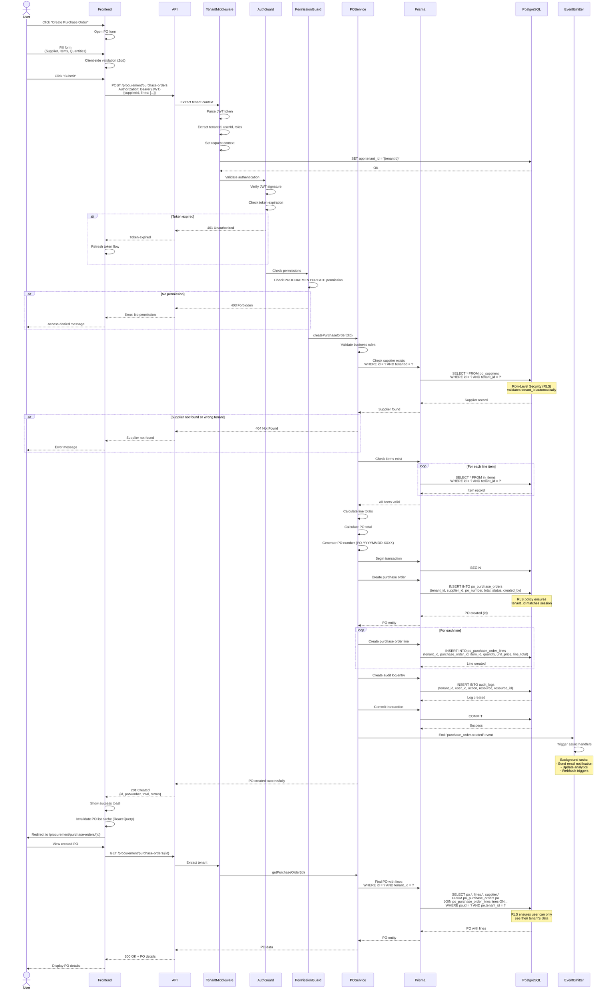

# Create Purchase Order - Sequence Diagram

**Key Multi-Tenant Security Features:**

1. **Tenant Context Isolation**
   - Tenant ID extracted from JWT (not from user input)
   - Set in PostgreSQL session: `SET app.tenant_id`
   - All queries automatically filtered

2. **Defense in Depth**
   - Layer 1: Middleware filters by tenantId
   - Layer 2: Prisma global middleware
   - Layer 3: PostgreSQL Row-Level Security (RLS)

3. **Authorization**
   - JWT authentication required
   - Permission check: PROCUREMENT:CREATE
   - Role-based access control (RBAC)

4. **Data Validation**
   - Client-side: Zod schema validation
   - Server-side: DTO validation (class-validator)
   - Business rules: Supplier must belong to tenant

5. **Audit Trail**
   - All create/update/delete logged
   - User ID, tenant ID, timestamp recorded
   - Complete audit trail for compliance

6. **Transaction Safety**
   - ACID transaction for PO + lines
   - All-or-nothing insertion
   - Rollback on any error

**Error Scenarios Handled:**
- Invalid/expired JWT → 401 Unauthorized
- No permission → 403 Forbidden
- Supplier not found → 404 Not Found
- Supplier belongs to different tenant → 404 (not 403, prevents enumeration)
- Validation errors → 400 Bad Request
- Database errors → 500 Internal Server Error (with rollback)