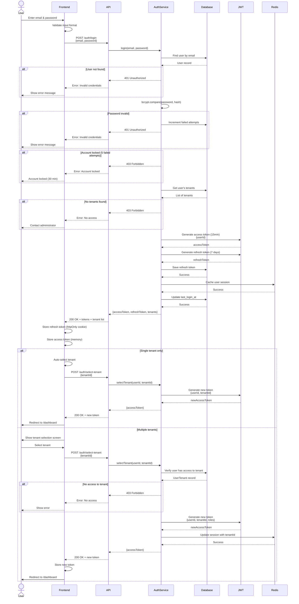

# User Login Flow - Sequence Diagram

**Key Security Features:**

1. **Password Security**
   - Hashed with bcrypt (cost factor 12)
   - Never transmitted or stored in plain text

2. **Account Lockout**
   - 5 failed attempts = 30-minute lockout
   - Prevents brute force attacks

3. **Token Strategy**
   - Short-lived access tokens (15 min)
   - Long-lived refresh tokens (7 days)
   - Refresh tokens stored in database (can be revoked)

4. **Multi-Tenant Isolation**
   - User must select tenant explicitly
   - Tenant ID embedded in JWT
   - Cannot be changed by client

5. **Session Management**
   - Session cached in Redis for performance
   - Last login tracked for auditing

**Error Handling:**
- Invalid credentials: Generic "Invalid email or password" (prevents enumeration)
- Account locked: Clear message with timeframe
- No access: Contact administrator message